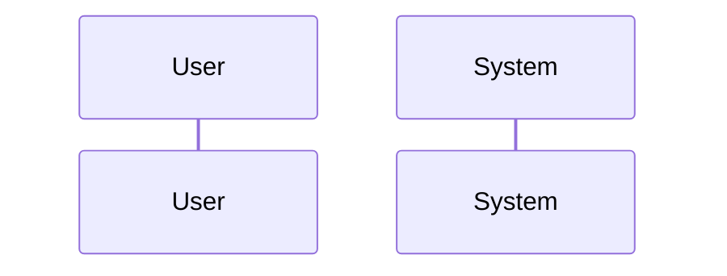

# Design: [Project Name]

> Generated by factory-architect

## 1. Overview
[2-3 paragraphs: what this design achieves and why]

### Goals
- ...

### Non-Goals
- ...

## 2. Architecture

### Existing Pattern Map


### Technology Stack
| Layer | Choice | Role | Notes |
|-------|--------|------|-------|
| | | | |

## 3. System Flows


> Only non-obvious flows. Skip trivial CRUD.

## 4. Requirements Traceability

| Req ID | Requirement | Component | Interface | Acceptance Criteria |
|--------|-------------|-----------|-----------|-------------------|
| R-001 | | | | AC-001 |

## 5. Components & Interfaces

### [Component Name]
```typescript
interface ComponentName {
  // typed signatures
}
```
- Responsibility:
- Dependencies:

## 6. Data Models

### [Model Name]
```typescript
interface ModelName {
  // fields
}
```
- Storage:
- Migration needed: Yes / No

## 7. Error Handling

| Error Scenario | Response | Recovery |
|----------------|----------|----------|
| | | |

## 8. Acceptance Criteria (Given/When/Then)

### AC-001: [Title]
```gherkin
Given [precondition]
When [action]
Then [expected outcome]
```

### AC-002: [Title]
```gherkin
Given [precondition]
When [action]
Then [expected outcome]
```

## 9. Change Impact Map

### Direct Impact
| File/Module | Change Type | Description |
|-------------|-------------|-------------|
| | Add / Modify / Delete | |

### Indirect Impact
| File/Module | Impact | Mitigation |
|-------------|--------|------------|
| | | |

### No-Effect Zone
These components are explicitly NOT affected:
- ...

## 10. Testing Strategy

| Level | Scope | Tool |
|-------|-------|------|
| Unit | | |
| Integration | | |
| E2E | | |

## 11. ADR (if applicable)

### ADR-001: [Decision Title]
- **Status**: Proposed / Accepted
- **Context**: [why this decision is needed]
- **Options**:

| Criteria | Option A | Option B | Option C |
|----------|----------|----------|----------|
| Effort | | | |
| Maintainability | | | |
| Risk | | | |

- **Decision**: Option [_]
- **Rationale**: [2-3 sentences]
